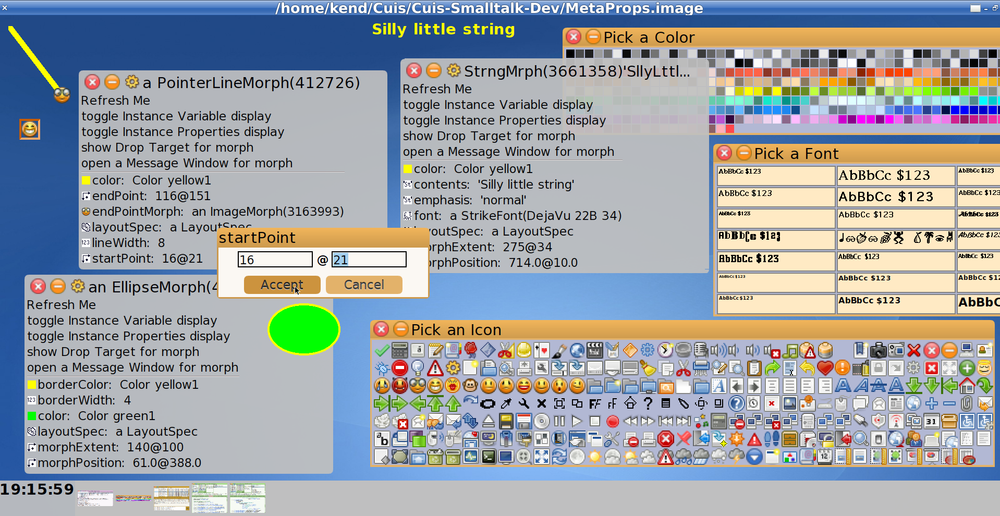

# Cuis-Smalltalk-MetaProperties
===============================
VisualPropertyEditor for Morphs

Tested in Cuis 5.0 revision 2986

````Smalltalk
	Feature require: #'Morphic-ColorEditor'.  "optional"
	Feature require: #'Morph-MetaProperties'. "NB: NOT 'Morphic' "

	(VisualPropertyEditor forMorph: EllipseMorph initializedInstance) openInWorld.
	"Click on Gear Icon to show EllipseMorph"
	ImagePallet namedColors.  "Click on a color and drop on a color property"
	(SignMorph forObject: 6) openInHand. "drop 6 on borderWidth property"
````

The basic usage is for annotating Morph subclasses for visual editing via DragNDrop.

This means making visual __only__ the instance variables and properties for controlling a Morph's visual characteristics in order to allow a ***VisualPropertyEditor*** to be constructed. 

This annotation is done by adding ***MetaProperties*** for the typical instance variables and properties.  MetaProperties are used to check what values an iVar #accepts:

See method #VisualPropertyEditor class>>initialize.

MetaProperties are immutable, so can be shared.  Many are predefined.  
````Smalltalk
(MetaProperty metaPropNamed: #acceptsColor) explore.
````




MetaMorph creation examples:
````Smalltalk
"Simple Class test"
(MetaProperty kind: String) accepts: #symbol.

"OneOf choice"
(MetaPropertyOneOf kind: Symbol choices: #(fee fie fo fum)) accepts: #fee.

"Number Range"
(MetaPropertyRange kind: Number minValue: 1 maxValue: 3) accepts: 1.2.

"Point Range"
(MetaPropertyRange kind: Point minValue: (0@0) maxValue: (4@4)) accepts: 1@3.

"Positive Point"
(MetaPropertyFrom kind: Point minValue: 0@0) accepts: 23@47.

"Pattern Match"
(MetaPropertyViaTest kind: String test: [ :s | '*baz*' match: s ]) accepts: 'mombazzi'.

````
